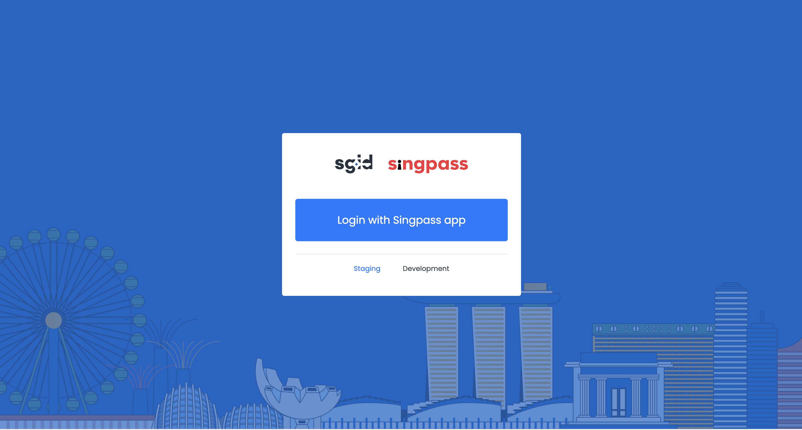

# sgID Test Application

This is an example node application that implements sgID's OAuth2 API.

## Pre-requisites

1. [Node.js](https://nodejs.org/en/download)

## Setup

### Install the dependencies

```
npm install
```

### Register the client with the `sgid-server`

1. Generate a client with the redirect_url=http://localhost:10000/callback
2. Add the client into the corresponding server db(be it dev, stage or production).

Instructions for both actions can be found in the README doc in the sgid-server repo (https://github.com/datagovsg/sgid-server). **Note: If you are running in dev, it is assumed that you have properly set up sgid-server on your local machine beforehand. If that is not the case, follow sgid-server's README to complete setup before doing so for sgid-test-app.**

### Setting up the .env variables

1. Refer to .env.example to create .env file
1. The following variables should be set with the generated client's values in .env:
   - private key
   - client id
   - client secret
   - scopes

## Running the app

1. Start nodemon by running `npm run dev`
1. Navigate to http://localhost:10000 on your browser. It should look like:
   <div>
    
   </div>
1. The "Login with Singpass App" interacts with the production sgid-server, whereas the "Staging" and "Development" links interact with the staging server and the local server respectively.
1. To test the sgid-test-app further, utilize sgid-mock-extension (https://github.com/datagovsg/sgid-mock-extension).
